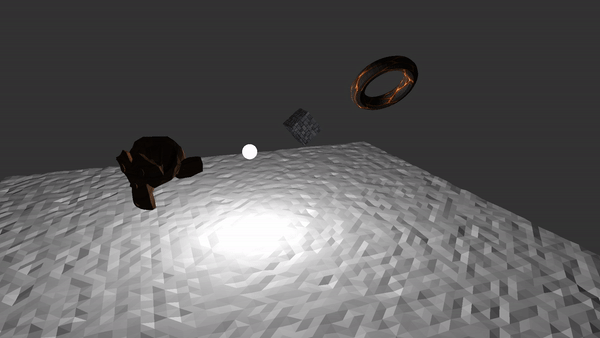

# Sandbox
 
A playground project for learning and experimenting with opengl 3.3 and c++ 17

## Table of contents
1. [External libraries](#external-libraries)
2. [Reference material](#reference-material)
3. [Development process](#development-process)

## External libraries

- glfw3
- glad
- glm
- stb (stb_image)

## Reference material

- [learnopengl.com](https://learnopengl.com/)

## Development process

 

