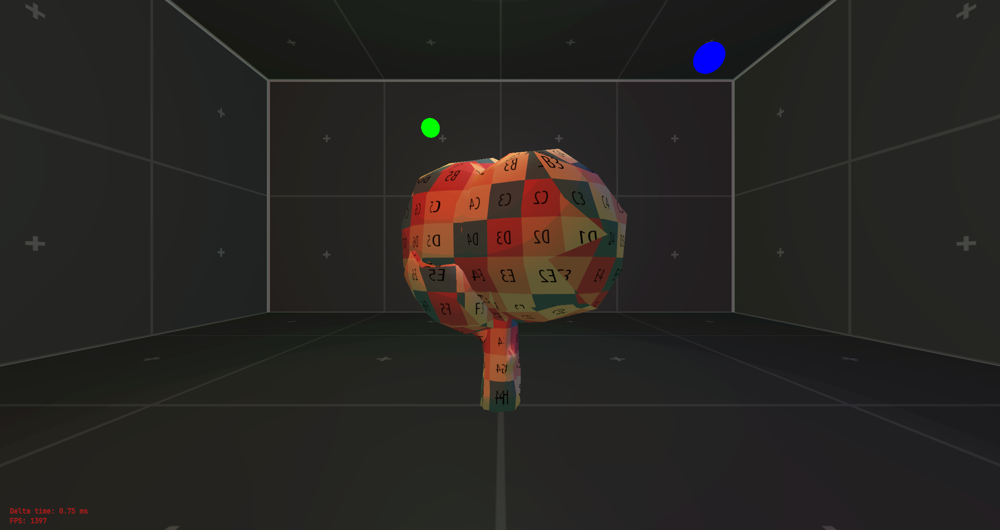

# Sandbox Game Engine

[](https://isocpp.org/)
[](https://github.com/KabelitzJ/sandbox/releases/tag/v0.1.0)
[](https://opensource.org/licenses/MIT)
[](https://kabelitzj.github.io/sandbox/)


This is a game engine project that is currently under heavy development and is mainly for educational purposes.

It is written in `C++20` and tries to use modern C++ features and best practices wherever possible.

## 📑 Table of Contents

- [🚀 Features](#-features)
- [🛠️ Getting Started](#️-getting-started)
  - [📋 Prerequisites](#-prerequisites)
  - [📥 Cloning the repository](#-cloning-the-repository)
  - [📦 Installing dependencies](#-installing-dependencies)
  - [🔨 Building](#-building)
  - [🚀 Running](#-running)
- [📝 Examples](#-examples)
  - [🌱 Create a new application](#-create-a-new-application)
  - [🎨 Create a new renderer](#-create-a-new-renderer)
  - [🎬 Define render passes and subrenderers](#-define-render-passes-and-subrenderers)
- [📷 Screenshots](#-screenshots)
- [🤝 Contributing and bug reports](#-contributing-and-bug-reports)
- [🔒 License](#-license)
- [📧 Contact](#-contact)

## 🚀 Features

Here are the features that are ready or under development:

- [x] Entity-Component-System architecture
- [x] 3D rendering
- [x] Scripting support 
- [x] Audio engine
- [x] Scene management
- [ ] Lighting system 🔜
- [ ] Post-processing effects 🔜
- [ ] 2D / UI rendering 🔜
- [ ] Physics engine 🔜
- [ ] Networking support 🔜
- [ ] AI system 🔜

## 🛠️ Getting Started

### 📋 Prerequisites

To build the project, you need the following tools:

- [CMake](https://cmake.org/)
- [Conan](https://conan.io/)
- [MinGW](https://www.mingw-w64.org/) (or any other C++ compiler), I recommend using [MSYS2](https://www.msys2.org/) to install MinGW

To get started with the project, follow these steps:

_Note: The project is configured so that all commands are run from the root directory of the project_

### 📥 Cloning the repository

To clone the repository, run the following command:

```bash
git clone https://github.com/KabelitzJ/sandbox.git
```

### 📦 Installing dependencies 

The dependencies for this project are managed using `Conan`. To install the dependencies, run the following command:

```bash
conan install . --profile=default --build=missing
```

### 🔨 Building

The project uses `CMake` as the build tool. To build the project, run the following commands:

```bash
cmake . -B "build/debug/" -G "MinGW Makefiles" -DCMAKE_BUILD_TYPE=Debug
```

Adjust the generator and build type according to your needs.

After that, run the following command to build the project:

```bash
cmake --build "build/debug/"
```
### 🚀 Running

To run the demo executable, run the following command:

```bash
./build/debug/bin/demo.exe
```

## 📝 Examples

The project comes with a demo executable that showcases the features of the engine. To run the demo, follow the steps in the [Running](#🚀-running) section.

### 🌱 Create a new application 

The demo creates a new class that derives from the `sbx::core::application` class. The application class is used to configure the game and to create the scene.
It then is passed to the engine via the `auto sbx::core::create_application() -> std::unique_ptr<sbx::core::application>` function.

```cpp
#include <libsbx/core/core.hpp>
#include <libsbx/assets/assets.hpp>
#include <libsbx/devices/devices.hpp>

class demo_application : public sbx::core::application {

public:

  demo_application() {
    // Configure the game

    // Get a reference to the devices module
    auto& devices_module = sbx::core::engine::get_module<sbx::devices::devices_module>();

    // Get a reference to the window
    auto& window = devices_module.window();

    // Register a callback for when the window is closed
    window.on_window_closed_signal() += [](const sbx::devices::window_closed_event& event){
      sbx::core::engine::quit();
    };

    // Get a reference to the assets module
    auto& assets_module = sbx::core::engine::get_module<sbx::assets::assets_module>();

    // Set the asset directory
    assets_module.set_asset_directory("./demo/assets");

    // Load a texture
    auto prototype_black_id = assets_module.load_asset<sbx::graphics::image2d>("res://textures/prototype_black.png");
  }

  ~demo_application() override {
    // Cleanup any resources
  }

  auto update() -> void  {
    // Update the game

    if (sbx::devices::input::is_key_pressed(sbx::devices::key::escape)) {
      // When the escape key is pressed, quit the game
      sbx::core::engine::quit();
    }
  }

}; // class demo_application

auto sbx::core::create_application() -> std::unique_ptr<sbx::core::application> {
  return std::make_unique<demo_application>();
}

```

### 🎨 Create a new renderer

To render anything to the screen, you need to create a class that derives from the `sbx::graphics::renderer` class. The renderer class is used to render everything from scenes over UI elements to
post-processing effects. It is passed to the engine via the `auto sbx::graphics::create_renderer() -> std::unique_ptr<sbx::graphics::renderer>` function.

```cpp
#include <libsbx/core/core.hpp>
#include <libsbx/graphics/graphics.hpp>

class demo_renderer : public sbx::graphics::renderer {

public:

  demo_renderer() {
    // Configure the renderer
  }

  ~demo_renderer() override {
    // Cleanup any resources
  }

  auto initialize() -> void override {
    // Initialize the renderer
  };

}; // class demo_renderer

class demo_application : public sbx::core::application {

public:

  demo_application() {
    // [...]

    // Get a reference to the graphics module
    auto& graphics_module = sbx::core::engine::get_module<sbx::graphics::graphics_module>();

    // Set the renderer
    graphics_module.set_renderer<demo_renderer>();
  }

}; // class demo_application

```

### 🎬 Define render passes and subrenderers

To render anything to the screen, you need to define a render pass and a subrenderer. The render pass is used to define the order in which the subrenderers are executed. The subrenderer is used to render things like meshes or UI elements.

```cpp
#include <libsbx/core/core.hpp>
#include <libsbx/graphics/graphics.hpp>
#include <libsbx/models/models.hpp>
#include <libsbx/ui/ui.hpp>

class demo_renderer : public sbx::graphics::renderer {

public:

  demo_renderer() {
    // Create all render attachments for the render stages
    auto attachments = std::vector<sbx::graphics::attachment>{
      sbx::graphics::attachment{0, "swapchain", sbx::graphics::attachment::type::swapchain},
      sbx::graphics::attachment{1, "depth", sbx::graphics::attachment::type::depth}
    };

    // Create all subpass bindings that associate subpasses with render attachments
    auto subpass_bindings = std::vector<sbx::graphics::subpass_binding>{
      sbx::graphics::subpass_binding{0, {0, 1}},
      sbx::graphics::subpass_binding{1, {0}}
    };

    // Add the render stage
    add_render_stage(std::move(attachments), std::move(subpass_bindings));
  }

  ~demo_renderer() override = default;

  auto initialize() -> void override {
    // Add subrenderers to render meshes and UI elements
    add_subrenderer<sbx::models::mesh_subrenderer>("res://shaders/cell_shading", sbx::graphics::pipeline::stage{0, 0});
    add_subrenderer<sbx::ui::ui_subrenderer>("res://shaders/ui", sbx::graphics::pipeline::stage{0, 1});
  }

}; // class demo_renderer

```

## 📷 Screenshots




## 🤝 Contributing and bug reports

Contributions to the project are welcome. To contribute, follow these steps:

1. Fork the repository
2. Create a new branch
3. Make your changes
4. Submit a pull request

If you find any bugs or have any suggestions, feel free to open an issue.

## 🔒 License

This project is licensed under the MIT License. See the [LICENSE](./LICENSE) file for details.

Feel free to use this project for your own purposes. If you do you may send me a message, I would love to see what you have created with this project.

## 📧 Contact

GitHub: [KabelitzJ](https://github.com/KabelitzJ)
